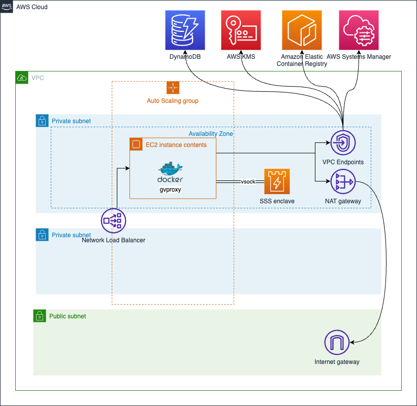
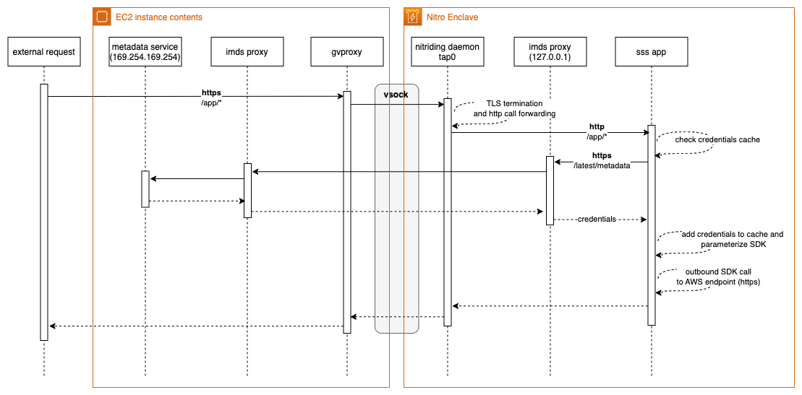
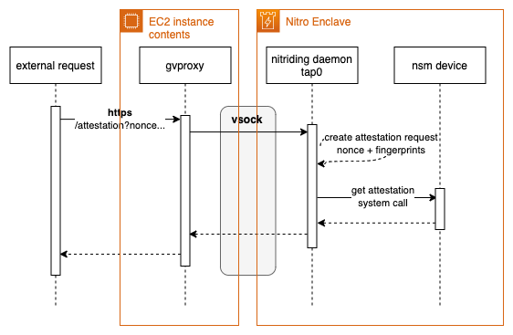
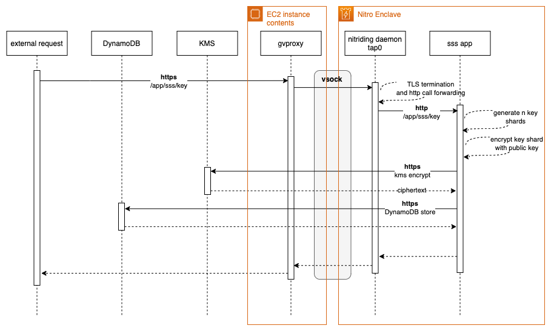
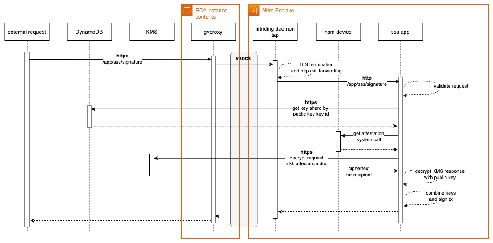

# AWS Nitro Enclave Advanced Attestation and MPC-Blockchain Wallet

## Architecture

### AWS Deployment


### SSS Application


## Deploying the solution with AWS CDK

Deploying the solution with the AWS CDK The AWS CDK is an open-source framework for defining and provisioning cloud
application resources. It uses common programming languages such as JavaScript, C#, and Python.
The [AWS CDK command line interface](https://docs.aws.amazon.com/cdk/latest/guide/cli.html) (CLI) allows you to interact
with CDK applications. It provides features like synthesizing AWS CloudFormation templates, confirming the security
changes, and deploying applications.

This section shows how to prepare the environment for running CDK and the sample code. For this walkthrough, you must
have the following prerequisites:

* An [AWS account](https://signin.aws.amazon.com/signin?redirect_uri=https%3A%2F%2Fportal.aws.amazon.com%2Fbilling%2Fsignup%2Fresume&client_id=signup).
* An IAM user with administrator access
* [Configured AWS credentials](https://docs.aws.amazon.com/cdk/latest/guide/getting_started.html#getting_started_prerequisites)
* Installed Node.js, Python 3, and pip. To install the example application:

When working with Python, it’s good practice to use [venv](https://docs.python.org/3/library/venv.html#module-venv) to
create project-specific virtual environments. The use of `venv` also reflects AWS CDK standard behavior. You can find
out more in the
workshop [Activating the virtualenv](https://cdkworkshop.com/30-python/20-create-project/200-virtualenv.html).

1. Install the CDK and test the CDK CLI:
    ```bash
    npm install -g aws-cdk && cdk --version
    ```
   
2. Download the code from the GitHub repo and switch in the new directory:
    ```bash
    git clone https://github.com/aws-samples/aws-nitro-enclave-blockchain-wallet.git && cd aws-nitro-enclave-blockchain-wallet
    ```
3. Install the dependencies using the Python package manager:
   ```bash
   pip install -r requirements.txt
   ```
4. Specify the AWS region and account for your deployment:
   ```bash
   export CDK_DEPLOY_REGION=us-east-1
   export CDK_DEPLOY_ACCOUNT=$(aws sts get-caller-identity | jq -r '.Account')
   ```
   
5. Specify which public IP should be used to interact with the application:
   ```bash
   export C9_PUBLIC_IP="$(curl https://checkip.amazonaws.com)"
   ```

6. Trigger the `vsock proxy` build:
   ```bash
   ./scripts/build_vsock_proxy.sh
   ```

7. Change into the `application/attestation/third-party` folder and install the following dependencies:
   * **nitriding-daemon**
   ```bash
   git clone https://github.com/brave/nitriding-daemon.git
   cd nitriding-daemon
   make nitriding
   cd ..
   ```
   * **nitride**
   ```bash
   git clone https://github.com/hf/nitrite.git
   cd nitrite
   go build -o nitrite ./cmd/nitrite
   cd ..
   ```
      
   * **gvisor**
   ```bash
   git clone --depth 1 --branch v0.7.4 https://github.com/containers/gvisor-tap-vsock.git
   cd gvisor-tap-vsock
   CGO_ENABLED=0 GOARCH=amd64 GOOS=linux go build -ldflags '-extldflags "-static"' -o bin/gvproxy-linux-amd64 ./cmd/gvproxy
   cd ..
   ```

8. Deploy the example code with the CDK CLI:
    ```bash
    cdk deploy devNitroWalletSSS -O nitrowallet_output.json
    ```

## KMS Key Policy

```json5
{
  "Version": "2012-10-17",
  "Statement": [
    {
      "Sid": "Enable decrypt from enclave",
      "Effect": "Allow",
      "Principal": {
        "AWS": "<devNitroWalletEth.EC2InstanceRoleARN>"
      },
      "Action": "kms:Decrypt",
      "Resource": "*",
      "Condition": {
        "StringEqualsIgnoreCase": {
          "kms:RecipientAttestation:ImageSha384": "<PCR0_VALUE_FROM_EIF_BUILD>"
        }
      }
    },
    {
      "Sid": "Enable encrypt from enclave",
      "Effect": "Allow",
      "Principal": {
          "AWS": "<devNitroWalletEth.EC2InstanceRoleARN>"
      },
      "Action": "kms:Encrypt",
      "Resource": "*"
      },
    {
      "Effect": "Allow",
      "Principal": {
        "AWS": "<KMS_ADMINISTRATOR_ROLE_ARN>"
      },
      "Action": [
        "kms:Create*",
        "kms:Describe*",
        "kms:Enable*",
        "kms:List*",
        "kms:Put*",
        "kms:Update*",
        "kms:Revoke*",
        "kms:Disable*",
        "kms:Get*",
        "kms:Delete*",
        "kms:ScheduleKeyDeletion",
        "kms:CancelKeyDeletion",
        "kms:GenerateDataKey",
        "kms:TagResource",
        "kms:UntagResource"
      ],
      "Resource": "*"
    }
  ]
}
```

To leverage the provided `generate_key_policy.sh` script, a CDK output file needs to be provided.
This file can be created by running the following command:
```bash
cdk deploy devNitroWalletEth -O output.json
```

After the `output.json` file has been created, the following command can be used to create the KMS key policy:
```bash
./scripts/generate_key_policy.sh ./output.json
```

If the debug mode has been turned on by appending `--debug-mode` to the enclaves start sequence, the enclaves PCR0 value in the AWS KMS key policy needs to be updated to `000000000000000000000000000000000000000000000000000000000000000000000000000000000000000000000000`,
otherwise AWS KMS will return error code `400`.

## Requests 
All subsequent requests require the `endpoint` variable to point to the NLB public DNS address:
```bash
export endpoint="<NLB public load balancer DNS>" 
```

All requests initiated by the enclave touching AWS service require a set of valid AWS credentials. 
The credentials are being pulled using the `imds` proxy flow as shown in the following diagram:

**Get Attestation Doc Flow**


### Get Attestation Doc
```bash
curl -k https://${endpoint}/enclave/attestation?nonce=ffffffffffffffffffffffffffffffffffffffff
```
**Get Attestation Doc Flow**



### Create New Key Shard
```bash
export recovery_public_key_b64=""
curl -k --header "Content-Type: application/json" \
  --request POST \
  --data '{"recovery_public_key_b64":"'"$recovery_public_key_b64"'"}' \
  "https://${endpoint}/app/sss/key"| jq '.'
```

**Key Shard Generation Flow**


### Get Signature

```bash
export key_shard_b64=""
export pub_key=""
export tx_hash=""
curl -k --header "Content-Type: application/json" \
  --request POST \
  --data '{"key_shard_b64":"'"${key_shard_b64}"'","pub_key":"'"${pub_key}"'","tx_hash":"'"${tx_hash}"'"}' \
  "https://${endpoint}/app/sss/signature" | jq '.'
```

**Signature Creation Flow**



## Cleaning up

Once you have completed the deployment and tested the application, clean up the environment to avoid incurring extra
cost. This command removes all resources in this stack provisioned by the CDK:

```bash
cdk destroy
```

## Security

See [CONTRIBUTING](CONTRIBUTING.md#security-issue-notifications) for more information.

## License

This library is licensed under the MIT-0 License. See the LICENSE file.
